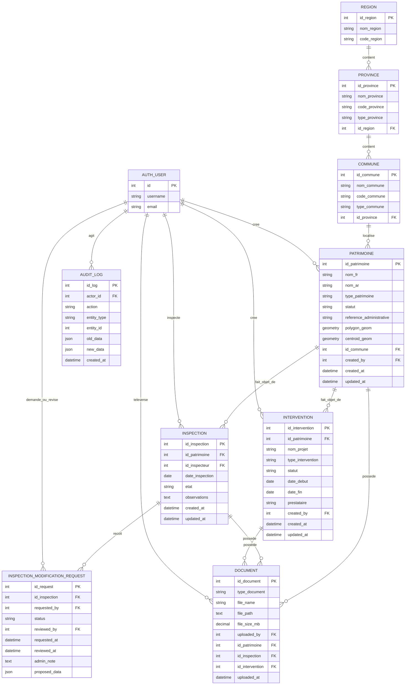

# Rapport Technique et Fonctionnel
## Plateforme de Gestion du Patrimoine (Django + PostGIS)

## 1. Résumé exécutif
La plateforme Patrimoine est une application web de gestion et de suivi des biens patrimoniaux, construite avec Django et PostgreSQL/PostGIS. Le système couvre les fonctions de recensement géospatial, d’inspection, d’intervention, de gestion documentaire, de gouvernance des utilisateurs et de traçabilité via journal d’audit.

Sur le plan architectural, le projet suit une organisation modulaire en deux applications Django principales:
- core: authentification, dashboards, page publique, navigation et composants transverses.
- patrimoine: logique métier (données territoriales, patrimoine, inspections, interventions, documents, administration fonctionnelle).

Le socle est conteneurisé avec Docker Compose et repose sur une stratégie SQL-first: le schéma principal est initialisé depuis mpd_complete.sql, puis exploité dans Django via des modèles non gérés (managed = False).

## 2. Contexte et objectifs du système
### 2.1 Problématique
Le besoin métier consiste à disposer d’un système unifié permettant:
- l’inventaire des sites patrimoniaux;
- la gestion géographique des entités (régions, provinces, communes, polygones);
- le suivi opérationnel des inspections et interventions;
- la conservation de documents justificatifs;
- le contrôle d’accès par rôle et la traçabilité des actions sensibles.

### 2.2 Objectifs techniques
- centraliser les données métier dans une base relationnelle spatiale;
- fournir une interface web orientée opérationnel et pilotage;
- séparer clairement les responsabilités applicatives;
- assurer l’auditabilité des opérations critiques;
- permettre un déploiement reproductible via Docker.

## 3. Architecture globale
### 3.1 Vue d’ensemble
L’architecture suit un modèle client-serveur web classique:
- Frontend: templates Django server-side (HTML + CSS + JS léger).
- Backend: Django (routing, vues, authentification, logique métier).
- Données: PostgreSQL + extension PostGIS pour les géométries.
- Fichiers: stockage média local (uploads images/documents).
- Intégrations: SMTP pour notifications utilisateurs.

### 3.2 Architecture de déploiement
Le projet est orchestré par Docker Compose avec deux services:
- db: image postgis/postgis:15-3.4, initialisation SQL automatique au premier lancement.
- web: image Python 3.12 slim construite localement, exécution des migrations puis lancement du serveur Django.

Bénéfices:
- environnement homogène entre postes;
- reproductibilité des démarrages;
- isolation des dépendances système (GDAL/GEOS/PROJ).

## 4. Organisation du code et séparation des responsabilités
### 4.1 Module core
Responsabilités principales:
- authentification et sessions;
- page publique cartographique;
- redirection dynamique des dashboards selon le rôle;
- backend d’authentification email/username;
- initialisation automatique des groupes ADMIN et INSPECTEUR.

Éléments structurants:
- core/views.py: navigation, dashboard, map publique.
- core/auth_backends.py: login via username ou email (insensible à la casse).
- core/signals.py: création des groupes par signal post_migrate.
- core/forms.py: formulaire de connexion basé sur email.

### 4.2 Module patrimoine
Responsabilités principales:
- modèle de données métier;
- CRUD patrimoine, inspection, intervention;
- gestion des documents et fichiers;
- exports CSV;
- gestion des utilisateurs (côté fonctionnel, réservé superadmin);
- journal d’audit.

Éléments structurants:
- patrimoine/models.py: entités métier et référentiel territorial.
- patrimoine/views.py: flux métier complets, contrôles d’accès, export, API utilitaires.
- patrimoine/urls.py: routes métiers et endpoints API.

## 5. Modèle de données
### 5.1 Caractéristiques générales
Le modèle suit une stratégie SQL-first:
- les tables sont considérées comme déjà définies côté base;
- les classes Django utilisent managed = False;
- les noms de colonnes/tables sont explicitement mappés.

Conséquence: la gouvernance du schéma est centrée sur SQL (mpd_complete.sql), tandis que Django agit en couche applicative et d’accès.

### 5.2 Entités majeures
Référentiel géographique:
- Region
- Province (liée à Region)
- Commune (liée à Province)

Noyau métier:
- Patrimoine: identité, description, statut, géométrie polygonale et centroid, rattachement commune.
- Inspection: état d’un patrimoine à une date, réalisée par un inspecteur.
- InspectionModificationRequest: demande d’édition d’inspection soumise par inspecteur et validée/rejetée par admin.
- Intervention: actions opérationnelles (restauration/réhabilitation/autres) sur patrimoine.
- Document: pièces jointes liées à patrimoine/inspection/intervention.
- AuditLog: traçabilité des opérations sensibles.

### 5.3 Données spatiales
Le système exploite PostGIS via:
- MultiPolygonField pour le contour du patrimoine;
- PointField pour centroid éventuel;
- import géométrique depuis GeoJSON ou fichiers KML/ZIP shapefile (via GDAL/GEOS).

## 6. Règles d’accès et gouvernance des rôles
Le contrôle d’accès est hybride:
- superadmin Django: droits complets et fonctions de gouvernance;
- groupe ADMIN: gestion opérationnelle avancée (édition patrimoine/interventions, validation demandes inspections);
- groupe INSPECTEUR: création inspections et demandes de modification des propres inspections;
- utilisateurs authentifiés sans groupe: accès public étendu au dashboard public.

Mécanismes observés:
- routage par rôle pour le dashboard;
- protections via login_required;
- vérifications explicites dans les vues selon rôle/groupe;
- interdiction de supprimer son propre compte superadmin depuis l’écran de gestion.

## 7. Flux fonctionnels principaux
### 7.1 Flux Patrimoine
- consultation liste avec filtres (nom, type, statut, région);
- création/édition avec géométrie (GeoJSON ou fichier spatial);
- upload d’images (contrôle nombre, taille, extension);
- suppression réservée superadmin;
- export CSV des résultats filtrés.

### 7.2 Flux Inspection
- création par INSPECTEUR;
- rattachement à un patrimoine;
- possibilité d’attacher des fichiers;
- workflow de modification différée:
  - inspecteur soumet une demande;
  - admin/superadmin approuve ou rejette;
  - audit des décisions.

### 7.3 Flux Intervention
- CRUD complet réservé aux profils éditeurs (admin/superadmin);
- filtres multi-critères et export CSV;
- association explicite au patrimoine cible.

### 7.4 Flux Documentaire
- centralisation des fichiers uploadés;
- suppression autorisée au créateur, admin ou superadmin;
- nettoyage du fichier physique lors de suppression logique.

### 7.5 Flux Administration Utilisateurs
- création utilisateur avec rôle (ADMIN/INSPECTEUR/PUBLIC);
- édition profil/rôle et éventuel renouvellement mot de passe;
- suppression contrôlée;
- notifications email de bienvenue et de mise à jour.

### 7.6 Flux Audit
- journalisation des opérations CREATE/UPDATE/DELETE et décisions de workflow;
- filtres par action, entité, acteur, dates;
- affichage restreint au superadmin.

## 8. Intégrations techniques
### 8.1 Intégration base de données
- PostgreSQL + PostGIS, connectés via psycopg.
- Schéma initial injecté automatiquement au bootstrap du conteneur DB.
- Requêtes ORM et ponctuellement SQL brut.

### 8.2 Intégration géospatiale
- bibliothèques système: GDAL, GEOS, PROJ;
- lecture de sources spatiales (KML/shapefile zip);
- conversion en géométrie compatible SRID 4326.

### 8.3 Intégration email
- SMTP configurable via variables d’environnement;
- envoi de messages de bienvenue et de notification de mise à jour utilisateur.

### 8.4 Intégration fichiers
- uploads via stockage Django par défaut;
- persistés sous media;
- métadonnées enregistrées en base (nom, chemin, taille, type).

## 9. Choix d’implémentation notables
### 9.1 Usage de SQL brut ciblé
Certaines opérations d’écriture sur patrimoine/inspection utilisent SQL brut. Motif explicite dans le code: contourner des contraintes liées à des colonnes générées et au pilotage de timestamps.

### 9.2 Journalisation applicative
Le système embarque une journalisation métier dédiée (AuditLog), complémentaire aux logs techniques.

### 9.3 API utilitaires internes
Des endpoints JSON facilitent le chaînage géographique région → province → commune → patrimoine, utiles aux formulaires dynamiques.

## 10. Qualités observées
- séparation fonctionnelle claire entre module transversal et module métier;
- gestion des rôles explicite et lisible;
- bonne couverture des besoins métier majeurs (inventaire, suivi, gouvernance);
- capacités d’export utiles au reporting;
- conteneurisation facilitant déploiement et transfert sur nouveaux postes.

## 11. Limites et points d’attention
- plusieurs endpoints API sont exemptés CSRF bien qu’en GET; c’est acceptable en lecture, mais nécessite une revue régulière de sécurité.
- l’approche managed = False impose une discipline stricte de versionnement SQL.
- le SQL brut améliore la robustesse sur cas spécifiques, mais augmente le coût de maintenance si le schéma évolue.
- le stockage média local convient au contexte actuel, mais devra être externalisé pour montée en charge multi-instance.

## 12. Recommandations académiques et techniques
### 12.1 Court terme
- documenter formellement le modèle de rôles et matrice des permissions;
- ajouter des tests automatisés sur workflows critiques (inspection request, audit, suppression document);
- formaliser les conventions de nommage des actions AuditLog.

### 12.2 Moyen terme
- introduire une couche service pour isoler davantage la logique métier des vues;
- ajouter pagination systématique sur listes volumineuses;
- renforcer l’observabilité (logs structurés, métriques applicatives).

### 12.3 Long terme
- envisager une API REST dédiée pour séparation front/back si besoin d’évolution UI;
- externaliser le stockage fichiers (objet storage);
- mettre en place CI/CD avec vérification qualité (tests, lint, sécurité).

## 13. Conclusion
La solution Patrimoine présente une architecture cohérente pour un système SIG métier orienté gestion patrimoniale. Le découpage applicatif, l’usage de PostGIS, les workflows de validation et la traçabilité offrent une base solide pour l’exploitation institutionnelle.

D’un point de vue académique, le projet illustre un cas pertinent d’intégration entre modélisation territoriale, gouvernance des rôles, chaîne de traitement documentaire et auditabilité opérationnelle. Avec une consolidation progressive de la qualité logicielle (tests, services, observabilité), la plateforme est bien positionnée pour une montée en maturité.

## Annexe A. Cartographie des composants
- Configuration globale: config/settings.py, config/urls.py
- Module transversal: core/views.py, core/forms.py, core/auth_backends.py, core/signals.py
- Module métier: patrimoine/models.py, patrimoine/views.py, patrimoine/urls.py
- Infrastructure: docker-compose.yml, docker/web/Dockerfile, requirements.txt
- Initialisation schéma: mpd_complete.sql
- Données de test: patrimoine/management/commands/seed_sample_patrimoines.py

## Annexe B. Diagramme de base de données (ERD)
Le schéma ci-dessous représente les entités métier principales et leurs relations. Les tables du système d’authentification Django (par exemple auth_user) sont externes au module métier mais liées fonctionnellement.

